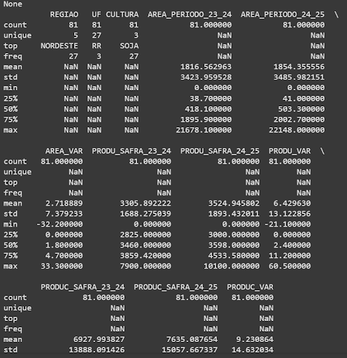
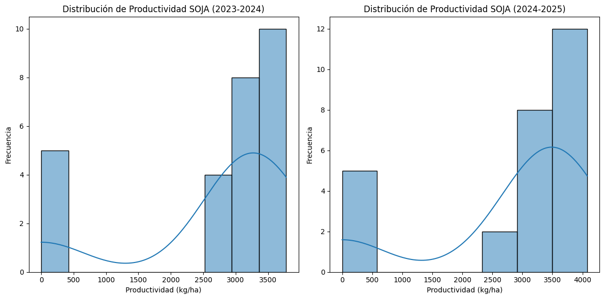
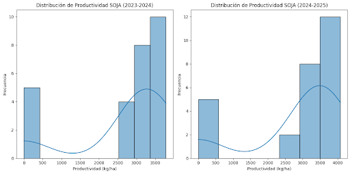
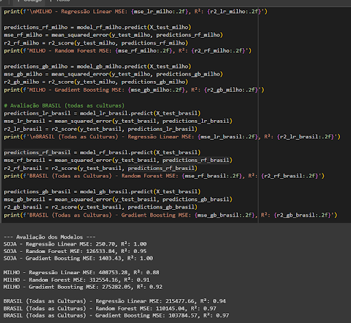
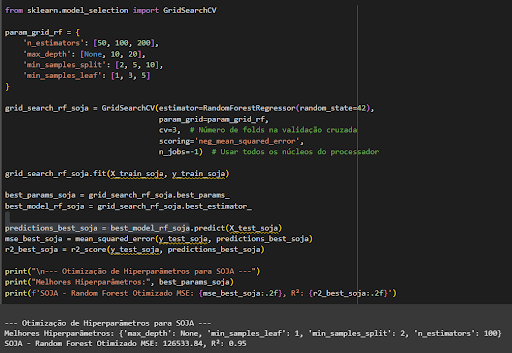
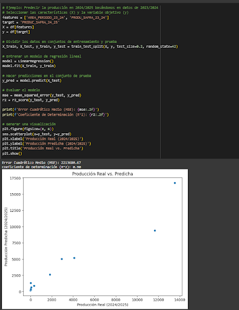
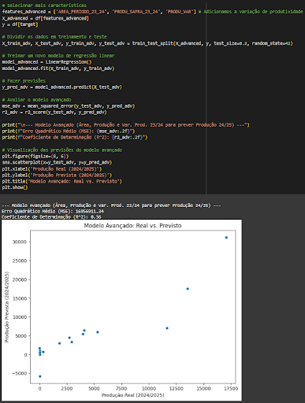
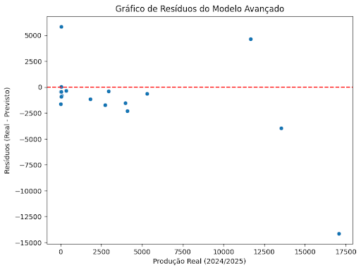
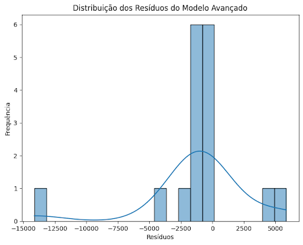

# FIAP - Faculdade de Informática e Administração Paulista

<p align="center">
<a href= "https://www.fiap.com.br/"></a>
</p>

<br>

# 🌱 Projeto de Previsão de Produtividade Agrícola com Machine Learning

## Nome do projeto
Fase 6 - Enterprise Challenge - Sprint 2 - Ingredion

## Nome do grupo
Grupo 37

## 👨‍🎓 Integrantes: 
- [Ana Beatriz Duarte Domingues](https://www.linkedin.com/in/)
- [Junior Rodrigues da Silva](https://www.linkedin.com/in/jrsilva051/)
- [Carlos Emilio Castillo Estrada](https://www.linkedin.com/in/)

## 👩‍🏫 Professores:
### Tutor(a)
- [Lucas Gomes Moreira](https://www.linkedin.com/company/inova-fusca)
### Coordenador(a)
- [André Godoi Chiovato](https://www.linkedin.com/company/inova-fusca)

---

## 📁 Estrutura de pastas

Dentre os arquivos e pastas presentes na raiz do projeto, definem-se:

- <b>.github</b>: Nesta pasta ficarão os arquivos de configuração específicos do GitHub que ajudam a gerenciar e automatizar processos no repositório.

- <b>assets</b>: aqui estão os arquivos relacionados a elementos não-estruturados deste repositório, como imagens.

- <b>config</b>: Posicione aqui arquivos de configuração que são usados para definir parâmetros e ajustes do projeto.

- <b>document</b>: aqui estão todos os documentos do projeto que as atividades poderão pedir. Na subpasta "other", adicione documentos complementares e menos importantes.

- <b>scripts</b>: Posicione aqui scripts auxiliares para tarefas específicas do seu projeto. 

- <b>src</b>: Todo o código fonte criado para o desenvolvimento do projeto.

- <b>README.md</b>: arquivo que serve como guia e explicação geral sobre o projeto.


## 📜 Descrição

Este projeto tem como objetivo desenvolver modelos de Inteligência Artificial capazes de prever a produtividade agrícola (soja e milho) no Brasil, utilizando dados históricos de safras e análise exploratória. Faz parte da Sprint 2 o tratamento de dados, testes com diferentes algoritmos de machine learning e avaliação de desempenho para apoiar a tomada de decisão no agronegócio.

## 🔍 1. Preparação dos Dados

Os dados utilizados contemplam indicadores de **área plantada**, **produtividade por hectare**, **produção total** e suas respectivas variações entre dois períodos: 2023–2024 e 2024–2025. As colunas principais são:

| Coluna | Descrição |
|--------|-----------|
| `REGIAO` | Região do Brasil |
| `UF` | Estado |
| `CULTURA` | Soja ou Milho |
| `AREA_PERIODO_23_24` | Área plantada em mil hectares (2023–2024) |
| `AREA_PERIODO_24_25` | Área plantada em mil hectares (2024–2025) |
| `AREA_VAR` | Variação percentual da área plantada |
| `PRODU_SAFRA_23_24` | Produtividade em kg/ha (2023–2024) |
| `PRODU_SAFRA_24_25` | Produtividade em kg/ha (2024–2025) |
| `PRODU_VAR` | Variação percentual da produtividade |
| `PRODUC_SAFRA_23_24` | Produção total em mil toneladas |
| `PRODUC_SAFRA_24_25` | Produção total em mil toneladas |
| `PRODUC_VAR` | Variação percentual da produção |

O processo de preparação dos dados incluiu:
- Padronização de colunas e tipos de dados
- Conversão de categorias para variáveis numéricas (one-hot encoding)
- Normalização de variáveis contínuas
- Separação por cultura e período



> *Figura 1 – Análise estatística dos dados.*

---

## 📊 2. Análise Exploratória e Justificativa das Variáveis

### Soja:
A análise visual sugere um aumento na produtividade da soja em 2024–2025, com mais áreas na faixa de 3500–4000 kg/ha.



> *Figura 2 – Distribuição da produtividade da soja nos períodos 2023–2024 e 2024–2025.*

Apesar do aumento geral, houve persistência de regiões com baixa produtividade (< 500 kg/ha), indicando possíveis fatores limitantes como solo ou clima.

### Milho:
No milho, observou-se maior dispersão nos dados de 2024–2025, com presença de produtividades tanto mais baixas quanto mais altas.



> *Figura 3 – Distribuição da produtividade do milho nos períodos 2023–2024 e 2024–2025.*

A faixa principal de 4500–6000 kg/ha permaneceu, mas surgiram extremos que indicam variabilidade climática ou de manejo.


✅ **Variáveis escolhidas para modelagem**:
- `REGIAO`, `UF`, `CULTURA`
- `AREA_VAR`, `PRODU_VAR`, `PRODUC_VAR`
- Valores absolutos das safras 23/24 como base para previsão da 24/25

Essas variáveis foram escolhidas por apresentarem **forte correlação com os resultados de produção futura**, além de fornecerem uma representação completa do cenário agrícola em diferentes regiões.

---
Testamos três abordagens:

| Modelo              | Vantagens                                    | Desvantagens                               |
|---------------------|----------------------------------------------|--------------------------------------------|
| Regressão Linear    | Simples e interpretável                      | Sujeita a underfitting                      |
| Random Forest       | Boa generalização, robusto contra overfitting| Requer mais processamento                   |
| Gradient Boosting   | Alta precisão em treino e teste              | Risco de overfitting                        |



> *Figura 4 – Avaliação do desempenho dos modelos usando Mean Squared Error (MSE) e o R-squared (R²).*

### 🔧 Ajuste de Hiperparâmetros e Otimização do Desempenho
- Random Forest: `n_estimators=100`, `max_depth=None`
- Técnicas utilizadas: `GridSearchCV` e `RandomizedSearchCV`.



> *Figura 5 – Otimização de Hiperparâmetros*

Os resultados da otimização de hiperparâmetros para o modelo Random Forest para soja são muito bons. Um R² de 0,95 sugere que o modelo é capaz de explicar grande parte da variabilidade na produtividade da soja, e o MSE de aproximadamente 126533,84 indica que os erros de previsão, em média, não são excessivamente grandes no contexto da escala de produtividade (que provavelmente varia em milhares de kg/ha).
Os melhores hiperparâmetros encontrados sugerem que, para a soja, um modelo Random Forest com alta complexidade (sem restrição de profundidade máxima) e um número razoável de árvores (100) funciona bem com os dados disponíveis.

---

## 📋 3. Avaliação Detalhada e Ajustes da Modelagem

### 3.1 Modelo de Regressão Linear Simples

Inicialmente, foi construído um modelo de regressão linear simples para prever a produção de 2024/2025 com base na produção de 2023/2024.

🔎 Observações do gráfico:
- O gráfico mostra uma forte correlação positiva entre a produção real e a produção predita.
- Os pontos estão relativamente próximos de uma linha reta imaginária, indicando que o modelo consegue prever a produção com boa precisão na maioria dos casos.
- O R² de 0.90 sugere que o modelo explica 90% da variabilidade na produção real.
- Apesar de alguns desvios, o modelo apresenta um bom ajuste aos dados.



> *Figura 6 – Previsão de produção 24/25 com base em 23/24 – Regressão Linear Simples.*

---

### 3.2 Teste com Diferentes Divisões de Dados (Simulado)

Como o conjunto de dados possui apenas dois períodos de tempo, simulamos diferentes divisões de dados para teste, variando a separação de treino e teste.

🔎 Observações do gráfico:
- A correlação entre a produção real e a prevista tornou-se fraca.
- Os pontos ficaram bastante dispersos.
- O R² caiu para 0.36, indicando que o modelo explica apenas 36% da variabilidade na produção real.
- O ajuste aos dados foi ruim, com grande diferença entre valores reais e previstos.



> *Figura 7 – Teste do modelo com outra divisão de dados.*

---

### 3.3 Ajuste da Estratégia de Modelagem (Adição de Novas Características)

Buscando melhorar a precisão, adicionamos novas variáveis ao modelo, como:
- Área cultivada
- Produtividade do ano anterior

🔎 Observações dos resultados e gráfico:
- Mesmo com mais características, o modelo avançado apresentou desempenho fraco.
- MSE e RMSE permaneceram altos.
- O R² continuou baixo em 0.36.
- O gráfico de resíduos mostrou grande dispersão, indicando erros significativos e imprecisão nas previsões.



> *Figura 8 – Resultados após adição de variáveis ao modelo.*



>*Figura 9 – Distribuição dos resíduos do modelo avançado.*
 
---

✅ Esses testes mostram que, embora o modelo inicial tivesse bom desempenho com divisão padrão, seu comportamento se deteriora com outras divisões e ajustes. Assim, é recomendado utilizar abordagens mais robustas (como Random Forest ou Gradient Boosting) para futuras previsões.

---

## 📈 4. Avaliação e Resultados

### Resultados – Soja

| Modelo            | R²     | MSE        |
|-------------------|--------|------------|
| Regressão Linear  | 1.00   | 250.70     |
| Random Forest     | 0.95   | 126533.84  |
| Gradient Boosting | 1.00   | 1403.43    |

- A Regressão Linear teve um erro muito baixo (MSE de 250.70) e acertou 100% da variação nos dados que usamos para teste (R² de 1.00).
- O Random Forest errou um pouco mais (MSE de 126533.84), mas ainda explicou 95% da variação (R² de 0.95).
- O Gradient Boosting também pareceu perfeito nos testes, com um erro baixo (MSE de 1403.43) e explicando 100% da variação (R² de 1.00).
Esses resultados perfeitos (R² de 1.00) para a Regressão Linear e o Gradient Boosting nos deixam alertas para uma possível memorização sem compreensão dos dados de teste, o que pode significar que eles não seriam tão bons em prever a produção de soja em situações novas. O Random Forest, apesar de errar um pouco mais nos testes, pode ser mais confiável para previsões futuras.


---

### Resultados – Milho

| Modelo            | R²     | MSE        |
|-------------------|--------|------------|
| Regressão Linear  | 0.88   | 408753.28  |
| Random Forest     | 0.91   | 312554.16  |
| Gradient Boosting | 0.92   | 275282.05  |

- A Regressão Linear teve um erro grande (MSE de 408753.28) e explicou 88% da variação (R² de 0.88).
- O Random Forest se saiu melhor, com um erro menor (MSE de 312554.16) e explicando 91% da variação (R² de 0.91).
- O Gradient Boosting foi o melhor, com o menor erro (MSE de 275282.05) e explicando 92% da variação (R² de 0.92).
Para o milho, o Gradient Boosting foi o método mais preciso, seguido pelo Random Forest, mostrando que métodos mais complexos funcionam melhor que uma simples linha reta (Regressão Linear).

---

### Resultados – Brasil (Todos os Dados)

| Modelo            | R²     | MSE        |
|-------------------|--------|------------|
| Regressão Linear  | 0.94   | 215477.66  |
| Random Forest     | 0.97   | 110145.04  |
| Gradient Boosting | 0.97   | 103784.57  |

- A Regressão Linear teve um erro de 215477.66 e explicou 94% da variação (R² de 0.94).
- O Random Forest reduziu o erro para 110145.04 e explicou 97% da variação (R² de 0.97).
- O Gradient Boosting teve o menor erro (103784.57) e também explicou 97% da variação (R² de 0.97).
Para a produção total do Brasil, tanto o Random Forest quanto o Gradient Boosting foram muito bons, explicando quase toda a variação nos dados. O Gradient Boosting teve um erro ligeiramente menor.

---

## ▶️ 5. Demonstração em Vídeo

🎥 [Clique aqui para assistir à demonstração no YouTube](https://youtu.be/KSfXhDJwzbc)

---

## ⚙️ 6. Como Executar o Projeto

```bash
# Instalar dependências
pip install -r config/requirements.txt

# Executar o pré-processamento
python scripts/pre_processamento.py

# Treinar o modelo
python scripts/treina_modelo.py
```

## 📚 Histórico de Lançamentos

* 0.1.0 - 24/04/2025
    * Primeira versão do projeto com análise exploratória, clusterização e modelos de regressão.

---

## 📋 Licença

<p xmlns:cc="http://creativecommons.org/ns#" xmlns:dct="http://purl.org/dc/terms/"><a property="dct:title" rel="cc:attributionURL" href="https://github.com/agodoi/template">MODELO GIT FIAP</a> por <a rel="cc:attributionURL dct:creator" property="cc:attributionName" href="https://fiap.com.br">Fiap</a> está licenciado sobre <a href="http://creativecommons.org/licenses/by/4.0/?ref=chooser-v1" target="_blank" rel="license noopener noreferrer" style="display:inline-block;">Attribution 4.0 International</a>.</p>
